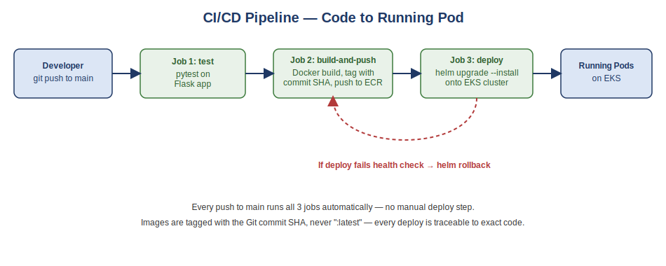

# CI/CD Pipeline — GitHub Actions to EKS

A fully automated pipeline that takes a code change from `git push` to a
running, health-checked pod on Kubernetes — no manual deploy steps. This is
Project 2 of a 3-part DevOps portfolio series, and it **deploys onto the EKS
cluster built in Project 1**.

1. [AWS Terraform + EKS Foundation](https://github.com/Oluwasola1/aws-terraform-eks-foundation)
2. **CI/CD Pipeline with GitHub Actions** ← you are here
3. Observability Stack with Prometheus + Grafana

## Pipeline overview



Every push to `main` runs three jobs automatically:

1. **test** — installs dependencies and runs `pytest` against the Flask app
2. **build-and-push** — builds a Docker image, tags it with the Git commit
   short SHA (never `:latest` — every deploy is traceable to exact code),
   and pushes it to Amazon ECR
3. **deploy** — runs `helm upgrade --install` against the EKS cluster from
   Project 1; if the rollout doesn't become healthy within the timeout,
   the workflow automatically runs `helm rollback`

## Tech stack

| Layer | Tool |
|---|---|
| Application | Python (Flask) |
| Container | Docker |
| Image registry | Amazon ECR |
| CI/CD | GitHub Actions |
| Deployment | Helm, onto the EKS cluster from Project 1 |

## Prerequisites

- **Project 1's EKS cluster must be up and running** (`terraform apply` in
  that repo) — this pipeline deploys onto it, it doesn't create its own
  cluster.
- Docker Desktop (for testing the build locally, optional)
- The AWS CLI, Terraform, and Helm from Project 1's setup

## Repo structure

```
cicd-pipeline-eks-deploy/
├── README.md
├── .gitignore
├── diagrams/
│   └── pipeline.svg
├── app/
│   ├── app.py               # Flask app: "/" and "/health" endpoints
│   ├── requirements.txt
│   └── test_app.py          # pytest tests run by the pipeline
├── Dockerfile                # multi-stage, non-root user, small image
├── helm/
│   └── cicd-demo/            # Helm chart the pipeline deploys
├── terraform/
│   └── main.tf                # creates the ECR repository only
├── .github/
│   └── workflows/
│       └── deploy.yml         # the pipeline itself
└── screenshots/
```

## Step-by-step

### 1. Create the ECR repository

```bash
cd terraform
terraform init
terraform apply
```

Note the `repository_url` output — you won't need to paste it anywhere
manually, but it confirms the repo now exists in AWS.

### 2. Create an IAM user for GitHub Actions (or reuse your existing one)

GitHub Actions needs its own AWS credentials to push to ECR and deploy to
EKS. You can reuse the `terraform-cli` IAM user from Project 1, or (better
practice) create a dedicated one scoped to just ECR push/pull and EKS
describe/update actions.

### 3. Add GitHub repo secrets

In your GitHub repo: **Settings → Secrets and variables → Actions → New
repository secret**. Add:

- `AWS_ACCESS_KEY_ID`
- `AWS_SECRET_ACCESS_KEY`

### 4. Push to `main`

```bash
git add .
git commit -m "Initial commit: CI/CD pipeline for Flask app"
git push -u origin main
```

This alone triggers the pipeline — go to the **Actions** tab on GitHub and
watch the three jobs run in order.

### 5. Verify the deployment

Once the `deploy` job succeeds:

```bash
kubectl get pods
kubectl get svc cicd-demo
```

Open the `EXTERNAL-IP` from the service in a browser — you should see the
JSON response from the Flask app, including the Git commit SHA baked into
the image tag.

### 6. Make a change and watch it deploy automatically

Edit the message in `app/app.py`, commit, and push again. Watch the Actions
tab — the whole pipeline reruns and your change appears live within a few
minutes, with zero manual deploy commands.

### 7. Cleanup

```bash
helm uninstall cicd-demo
cd terraform
terraform destroy
```

Remember Project 1's cluster is separate — destroy it too from that repo
when you're done working, to stop all charges.

## What this project demonstrates

- End-to-end CI/CD: test → build → push → deploy, fully automated
- Immutable image tagging (commit SHA, not `:latest`) for traceability
- Automatic rollback on failed deployments — not just "hope it works"
- Working with GitHub Actions secrets and AWS IAM credentials securely
- Helm as the deployment mechanism, reusing the cluster from Project 1

---

**Author:** Oluwasola Ogundana — [GitHub](https://github.com/Oluwasola1)
